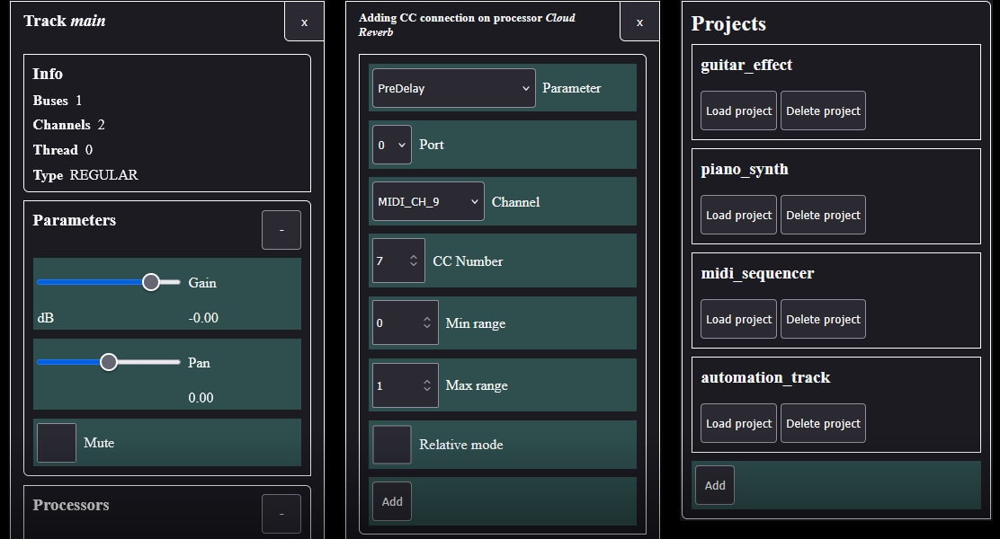
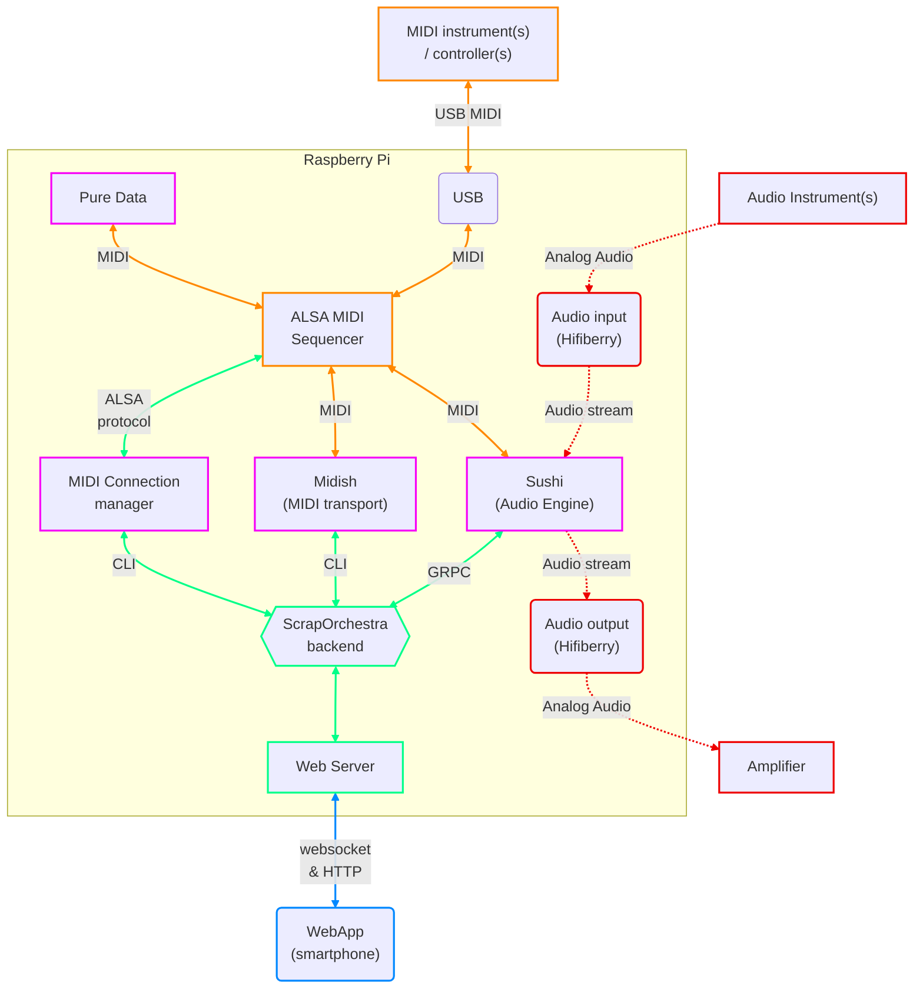

# ScrapOrchestra

> [!CAUTION]
> Version 0.0.9
> This is a very early alpha prototype.

<hr>

ScrapOrchestra is a web-based project and audio/MIDI configuration manager for a Raspberry Pi running [Elk Audio Operating System](https://elk-audio.github.io/elk-docs/html/intro/how_elk_works.html) (Elk Pi).

It lets you create, edit, save, and load musical projects from a phone or tablet, without needing to work directly with Linux shell commands or configuration files.




The main benefits are:
  * Create a musical project from scratch or reconfigure an existing one without having to carry a computer around.
  * Abstract most of Linux shell scripting and Sushi JSON writing away.
  * Easily switch between different setups. 
  * Extend Elk Pi MIDI features (transport, automatic reconnections, scripting).


## Architecture


### Legend
* $\color{#e00}{\textsf{█}}$ Audio path
* $\color{#f80}{\textsf{█}}$ Midi path
* $\color{#08f}{\textsf{█}}$ Web path
* $\color{#f700f7}{\textsf{█}}$ Optional components
* $\color{#0f8}{\textsf{█}}$ ScrapOrchestra implementation


## Project & components

A project in ScrapOrchestra is a collection of [components](components) (Node.js wrappers around external Linux programs, together with the configuration and session data needed to manage them).


There are currently 3 implemented components that can be accessed and configured per-project via the web app: 

* [Sushi](https://elk-audio.github.io/elk-docs/html/sushi/sushi_overview.html) by Elk Audio (Audio/DSP engine, plugin host)
* MIDI Connections manager (small monitor & manager for ALSA MIDI sequencer inspired by [midiminder](https://github.com/mzero/midiminder))
* [Midish](https://midish.org/) by Alexandre Ratchov (MIDI transport, MIDI filter)

ScrapOrchestra projects can also interface with [Pure Data](https://github.com/pure-data) by Miller Puckette but with important limitations. 
See the dedicated [readme](https://github.com/OlivierSch755/scraporchestra/tree/main/components/pure_data) for more information. 

### Project structure  

A ScrapOrchestra project lives in a directory that contains:
* **project.json** file, which contains:
  * project metadata (name, creation date...)
  * a list of required components + some basic config for them
* Optional files created and managed by components to hold their session data

Loading a project consists of: 
* Reading the list of installed components in the **project.json** file
* **Loading** and **initializing** each component
  * This usually means spawning one or more child processes
  * Restoring optional session data using whatever mechanism the external program provides (stdin CLI, GRPC)
* Notifying readiness after system has reached a state that is safe for user to start playing music. 

The ScrapOrchestra Engine also ensures that resources are properly released when closing projects. 


## Installation


As this is still a very early work in progress, build & packaging are not very straightforward yet.


### Requirements 

* At least 400mb of disk space for a full installation
  * ~200mb for Node.js binaries
  * ~50mb for ScrapOrchestra code and all optional components
  * ~50mb (temporary) to compile components
  * ~100mb more to be safe (we still need to store project data afterwards)
* Installation requires downloading libraries and therefore requires the Raspberry Pi to have internet connection.

### Preparing the Pi

This walk-through assumes direct installation on a Raspberry pi 4 running [Elk Pi image](https://github.com/elk-audio/elk-pi). I strongly recommend using the image provided with plugins pre-installed (the webUi to edit Sushi implements them as well). 

Start by making sure disk has write access. 
```
sudo elk_system_utils --remount-as-rw
```

### Installing Node.js on Elk Pi 

App is written in *Node.js*, which is not found in default Elk Pi releases. 

This will download Node.js binaries, 
install them under ```/opt/node-vXX.XX.xf```
and symlink them to ```/usr/local/bin```

```sh
# download binaries
wget https://nodejs.org/dist/v24.19.0/node-v24.19.0-linux-arm64.tar.xz

# extract binaries
tar -xf node-v24.19.0-linux-arm64.tar.xz

# move binaries
sudo mv node-v24.19.0-linux-arm64 /opt/node-v24.19.0

# create /usr/local/bin if not already there
sudo mkdir -p /usr/local/bin

# expose in path via symlink
sudo ln -s /opt/node-v24.19.0/bin/node /usr/local/bin/node
sudo ln -s /opt/node-v24.19.0/bin/npm /usr/local/bin/npm
sudo ln -s /opt/node-v24.19.0/bin/npx /usr/local/bin/npx

# cleanup download artefacts
rm node-v24.19.0-linux-arm64.tar.xz
```

Version 24.19.0 happens to be the latest release at the time of writing this documentation. Many other versions should work too. 


### Installing ScrapOrchestra on Elk Pi 

```sh
# download app
wget -O scraporchestra.tar.gz https://github.com/OlivierSch755/scraporchestra/archive/refs/heads/main.tar.gz

# extract archive
tar -xzf scraporchestra.tar.gz

# remove archive
rm scraporchestra.tar.gz

# move app directory in /opt
sudo mv scraporchestra-main /opt/scraporchestra

# navigate to app installation directory
cd /opt/scraporchestra

# install Node.js application
npm install 
```

### Installing optional components 

Most components contain native C code and must be compiled. All of them are lightweight enough to build directly on a Raspberry Pi.

Build dependencies used to compile components are already provided in Elk Pi development image. 

```sh
# navigate to components directory
cd /opt/scraporchestra/components
```

Either build them all by simply running 
```sh
make
```

**Or** pick individual components to build
```sh
cd midish
make
cd ..
cd midi_connections
make
cd ..

# and so on... 
```

If you are unsure of what component to install, see the readme for the [components](components) section. 

Or just build them all, a Raspberry Pi 4 with a decent internet connection will download and compile everything in less than 5 minutes.


### Systemd service (run at boot)

A service file is available in the installation directory that you can install with systemd.

```sh
# copy service file
sudo cp /opt/scraporchestra/scraporchestra.service /etc/systemd/system/

# reload systemd cache
sudo systemctl daemon-reload

# make service run at boot
sudo systemctl enable scraporchestra

# run service right now 
sudo systemctl start scraporchestra
```

Since ScrapOrchestra manages tasks like running Sushi, you should avoid having other services perform similar operations. Otherwise:
* you may find the audio driver busy when you need it.
* you may find weird duplicates in MIDI port listings.
* and probably many more issues...


## Running ScrapOrchestra 

If you installed it via Systemd service as described above, simply run 

```sh
sudo systemctl start scraporchestra
```


If for some reason you need to manually start ScrapOrchestra (engine + web application)
```sh
# run app directly
node /opt/scraporchestra/bin/webapp.js
```

> [!CAUTION]
> Be mindful that having more than ONE instance of ScrapOrchestra running at the same time is not supported. 


Once running, ScrapOrchestra exposes a web server on port 3000. 

That is to say, if your Elk Box IP address is ```192.168.0.1```, you can reach the web interface by opening ```http://192.168.0.1:3000``` in a web browser running on a device connected to the same network. 


## License
This project is MIT-licensed.
It integrates with optional third-party components, which may be downloaded and built separately under their respective licenses.
