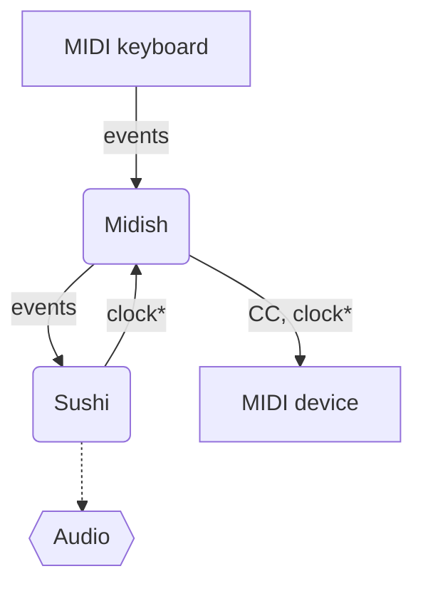
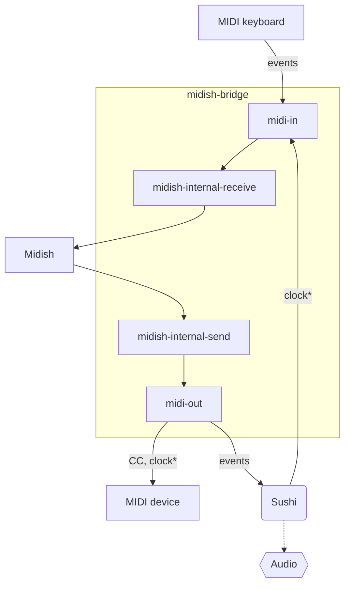

# MIDISH Component

This component implements [Midish](https://midish.org/) by Alexandre Ratchov. It provides extended MIDI features that are not natively available in Elk Audio OS, such as:
* MIDI transport
* Advanced MIDI filtering (keyboard split, transposition, user-defined filters)
* Importing a MIDI file (.mid)
* Muting / unmuting tracks
* And more. 

## Build 

To compile and install this, run ```make``` from this directory. 

This will fetch Midish source code, compile it and install the resulting executable (one file) ```./bin/midish```. 

This will also build a custom C utility ```./src/bridge.c``` into ```./bin/midish-bridge``` (see *Midish Bridge* section below).


## Editor mode 

Midish editor is an implementation of Midish user manual [section 21.2 Creating front-ends: verbose mode](https://midish.org/manual.html#section_21_2).

Current [implementation](MidishController.js) provided for the webUi is still very experimental and should be used with care. 

Unlike many other components in this repository, Midish does not have a separate editor mode that needs to be enabled or disabled from the webUi.
Midish architecture is already well-optimized for headless control by a wrapper program and there is no need to isolate editor functions in a disposable memory-space. This means all Midish editor functions can be accessed at any time from the project page via the component configuration widget. 


## Midish Bridge

Midish is not really supposed to be used in a context where MIDI ports connections are expected to change during its runtime. 

It usually wants this type of sequence: 
* Receives "play" command
* Creates client ports in ALSA MIDI Sequencer and connects to whatever ports it was configured for
* Receives "stop" command
* Cleans up (destroys) its client ports

This conflicts with ScrapOrchestra philosophy. 

For example, the following use case should be perfectly valid:
* Midish is already playing 
* User connects a MIDI keyboard via USB
* User starts playing along with *no interruption*


To solve this we use the ```midish-bridge``` custom C utility (see [source code](src/bridge.c)). 

It creates a stable ALSA MIDI Sequencer client that acts as a bridge between Midish and other applications. 

So instead of connecting like this: 



We use a stable connection that every device and software can connect to:



The extra ports improve the architecture's separation of concerns and make routing easier to manage.

(\*) This is only an example to illustrate the architecture routing. Midish *can* be slaved to Sushi, but clock can also go the other way around (or both software can use their own separate clocks). 


## Lifecycle
### Installation phase
* Nothing

### Initialization phase
* ```bin/midish``` executable is spawned as a child process. 
* It receives some commands over stdin to bootstrap the session (define ports, defaults filters...)
* If a ```midish.msh``` file exists in project directory, instruct midish to load it.  

### Save project phase
* Instruct midish process to save its session into project directory ```midish.msh```.

### Close phase 
* Terminates midish process. 


## Config data 
There are some rare user-defined parameters that can be useful to store but which are not persisted when calling midish ```save``` command to store the session.
We persist those in the project config file:
* loop mode state.
* metronome state.
* more may be added to this list later. 


## Session data 
Component session is saved in project directory in a single file: ```midish.msh```

