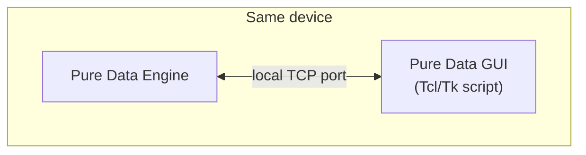
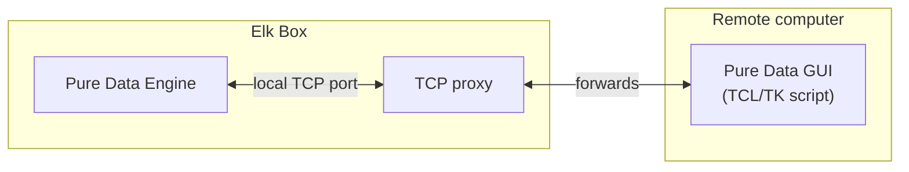

# PURE DATA Component

Before using this component, there are a few important things to understand:

* Pure Data support was added primarily for its MIDI and OSC engines.
    * Using Pure Data DSP engine is not recommended. Sushi uses ELK Audio ultra-low-latency kernel and should therefore remain in charge of DSP tasks.
    * You should not try using Pure Data DSP engine while Sushi is running. 
    * If you decide *not to use Sushi* in some project, you *could* use Pure Data DSP engine instead, but this is not the intended use for this component and I personally have zero plan to support anything in this direction. 

    
* There *is* an **editor mode** that gives you remote access to the Pure Data session, including: 
    * Pure Data console, which is particularly useful for inspecting MIDI events directly on the Elk Box.
    * MIDI scripting with real-time visual feedback. 
    * **Editor mode cannot be used through the webUi**. The webUi only enables editor mode. You need a real computer running the Pure Data GUI to actually use it. See the Editor mode section below


## Build 

To compile and install this, run ```make``` from this directory. 

This will fetch Pure Data source code, compile it and install it in ```./install``` subdirectory. 

Build configuration is as follows: 
```
	--disable-oss \
	--disable-jack \
	--disable-wasapi \
	--disable-sgi \
	--disable-portaudio
```

It should be straightforward to edit the Makefile if you need something different. 


## Editor mode 

The webUi only **enables** editor mode. The actual Pure Data editor must run on a **remote computer**.

Editor mode requires the user to run the Pure Data GUI (Tcl/Tk script) on a separate computer.

The Pure Data GUI communicates with the engine over TCP. Normally, the GUI connects to a TCP port opened by the Pure Data engine on the same machine:



We intercept that connection and expose it through a static TCP port.


> [!NOTE]
> The schema is slightly simplified because Pure Data dynamically selects its GUI port, which the proxy discovers via UDP.

The Elk Box therefore exposes a TCP port that allows a remote Pure Data GUI to communicate with the Pure Data engine.


TCP Port for remote GUI is **58033**.

Once Pure Data is running in editor mode and you have a remote computer with a matching Pure Data installation:
* navigate to the Pure Data installation directory on the remote computer. 
* use the provided ```wish``` executable from the ```bin``` directory to run ```tcl\pd-gui.tcl "192.168.xxx.xxx:58033"``` 
    * replace the command-line argument ```"192.168.xxx.xxx"``` accordingly with your Elk Box current IP address. 


### Limitations & caveats
Because we abuse Pure Data GUI protocol to edit it remotely, there are a few things to consider: 
* The GUI script on the remote computer must match the Pure Data version installed on the Elk Box. 
* Switching between editor mode and non-editor mode requires **restarting** Pure Data.
    * If your patch relies on a sequencer sampling data over time, it may be lost when starting editor mode. 
* Clicking on file -> save from editor GUI will directly try to write to disk. 
    * This breaks an important ScrapOrchestra UI contract: *changes made to a project should not be persisted until user clicks on "save configuration" button.* 
* Similarly, if multiple projects use shared abstractions, remote GUI will happily edit and overwrite them (potentially breaking other projects). 


## Lifecycle

### Installation phase
* Default Pure Data project file ```pure_data.pd``` is copied into the project directory. 

### Initialization phase
* ```pd``` executable is spawned as a child process. 
* It receives via command-line arguments the path to the project's ```pure_data.pd``` file to load the project session.
* It also applies via command-line arguments the component configuration (MIDI ports, abstraction path).

### Save project phase
Nothing. Session must be edited and saved via Editor mode which bypasses ScrapOrchestra's project manager. Changes are persisted by clicking "file -> save" in remote GUI. 

### Close phase 
* Terminates pd process. 
* Terminates editor TCP ports (if in editor mode).

## Config data 
The following entries may be stored in the project configuration: 
* Number of required MIDI input ports 
* Number of required MIDI output ports 
* Path to abstraction directory

## Session data 
Component session is saved in project directory in a single file: ```pure_data.pd```

