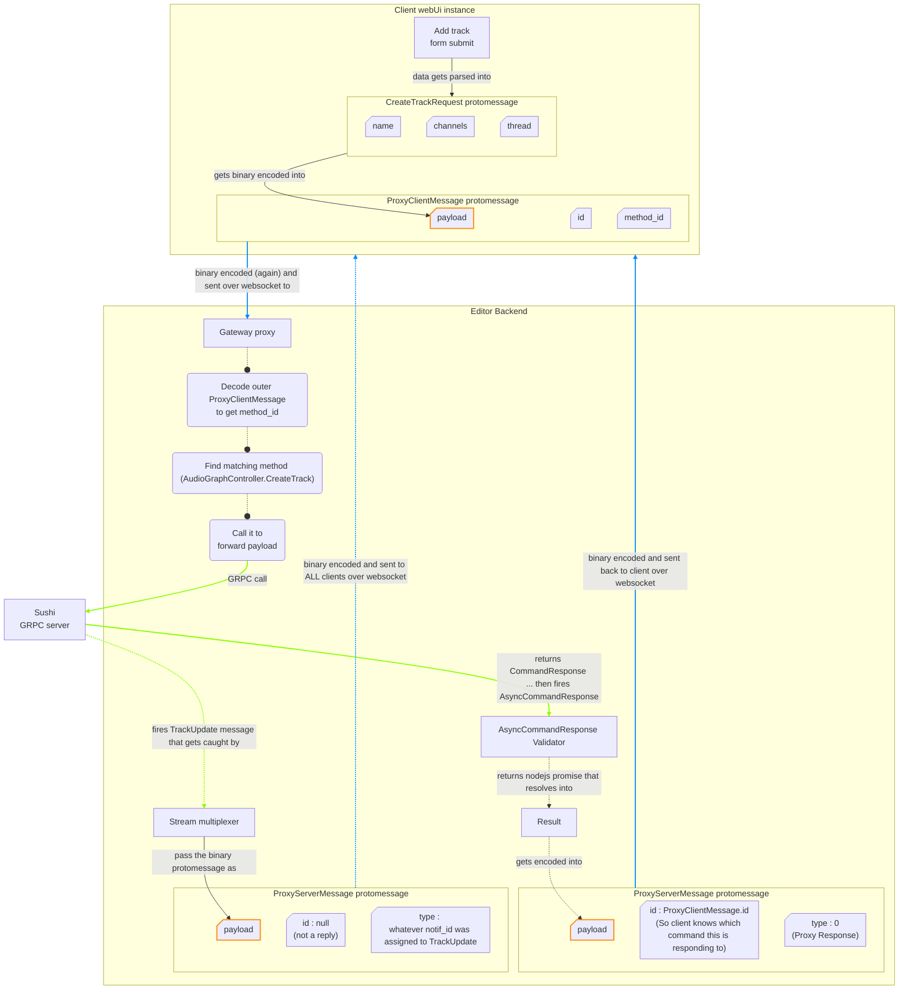

# SUSHI Web Editor 


> [!CAUTION]
> This program allows you to edit Sushi (a live DSP engine) over a web interface that is meant to run on a small display (smartphone).
> * You **REALLY** should have a **hardware volume control** between the audio output of your Elk Box and your amp/headphones. 
> * There are **MANY** ways to accidentally produce a **VERY LOUD** sound that may damage your hearing, speakers and relationship with your neighbors. 
> * The button to stop that annoying sound may be many clicks away in the webUi. 
> * Your mobile phone may run out of battery, freeze or someone may call you while you are looking for the aforementioned button. 
> * Be safe, always have a hardware volume control you can easily reach while you are editing Sushi. 

<hr>

This is a very complicated and overengineered Node.js module that exposes a gateway proxy and a web interface to control Sushi over GRPC. 

It tries to be as extensive as possible to cover many use cases. 

It does implement : 
* SystemController
    * but not completely as it is not exposed in the web ui (it should)
* TransportController 
    * GetSamplerate is missing
* KeyboardController 
    * Just enough to send basic command from webUi and test tracks audio output. 
* AudioGraphController 
* ProgramController 
* ParameterController
* MidiController
* SessionController 
    * May crash when using vst2
* NotificationController 
    * See **advanced convenience features** section below. 


It does not implement : 
* OscController (but it will in the future)
* TimingController (it should)
* CvGateController (I did not read the doc for this yet, have no idea if it is even supposed to be used on a raspberry pi, so a bit of thinking is needed here)


Bear in mind that this is a very early Alpha prototype which is **far** from production ready. 


## Dependencies 

This makes extensive use of [protobuf.js](https://github.com/protobufjs/protobuf.js) and also uses [grpc-js](https://www.npmjs.com/package/@grpc/grpc-js) which provides a GRPC client implementation. Both of those are provided by npm and there are no dependencies to compile. 

[Express.js](https://expressjs.com/) and [ws](https://github.com/websockets/ws) libraries are used to expose a http/websocket transport with the backend. Again this is all native javascript that is provided with ```npm install```

The webUi shares a lot of front-end dependencies with the root server public path, those are css stylesheets, alpinejs front end libraries and most of custom UI blocks that are used in ScrapOrchestra UI. 


## How does it work


### Protobuf message Transport  

GRPC transport implementation uses **grpc-js** *dynamic_codegen* methodology. Here are some resources about it : 
* [grpc.io tutorial](https://grpc.io/docs/languages/node/basics/)
* [Github implementation Example](https://github.com/grpc/grpc-node/blob/master/examples/routeguide/dynamic_codegen/route_guide_client.js)


Here is roughly how the communication between Websocket and GRPC is achieved : 

* The backend receives a protobuf Root object (this is the sushi_rpc.proto file that has been parsed into a JS object). 
* It enumerates all services and methods found into the Root and assigns an ID to each method (using GRPC ```options``` field).
* It also exposes its own message types in a separate namespace *proxy_rpc*. 
* It exposes a new Root that contains both *sushi_rpc* and *proxy_rpc*.
* WebUi loads this new Root via HTTP request and create a protobuf [service](https://github.com/protobufjs/protobuf.js/#services) from it. 
* WebUi sends protobuf commands to *protobuf service* as if it were talking directly to Sushi. Those commands are encoded into binary format and wrapped into a ```ProxyClientMessage``` protomessage object (this is the message type from *proxy_rpc*)
* Backend only decodes the outer ProxyClientMessage layer which contain the ID of the method that was called, the actual Sushi GRPC command is still in binary form and can be fed directly into GRPC client. 

#### Some advanced convenience features : 

* While building the protobuf Root for the proxy, Backend also hooked interceptors into methods that return a ```CommandResponse``` so they can be resolved on the fly with an [async validator](lib/async_validation.js). **WebUi only receives command responses that have been pre-validated by the backend.**
* Backend also hooked interceptors into methods that return a GRPC stream in order to have those handled by a [stream multiplexer](lib/stream_ws_multiplexer.js). This allows having a single GRPC stream feeding notifications into multiple devices or browser tabs that may be open at the same time. 


#### Example 
Here is an example of what happens when the webUi requests the creation of a track :



If the transport layer is still obscure to you, you may want to have a look at : 
* [frontend client](public/js/sushi_client/client.js)
* [backend gateway dynamic generation](lib/gateway.js) 


### Frontend 

Most of the webUi abuses lazy loading methods so it should be safe to use with a potato smartphone (my case). This means : 
* A track processors will not be loaded until user opens the dialog window that is about this specific track.
* A processor parameters and such will not be loaded until user opens the dialog window that is about this specific processor.
* ... And so on. Of course data is cached once loaded.

This is achieved via a small [custom ORM](public/js/stores/sushi.js) and multiple Alpinejs Stores. 


To save bandwidth I purposely disabled the loading of parameters that are **not automatable**. This is also because current distribution of some plugins (such as JuicySfPlugin) have over 2000 parameters, most of which are just MIDI Control values. Those take ages to load while polluting the precious UI space of a mobile display. 

If you really need to see non-automatable parameters, comment out the instruction ```if( parameter.info.value.automatable === false ) return;``` in [./public/js/stores/parameterlist.js](public/js/stores/parameterlist.js)
